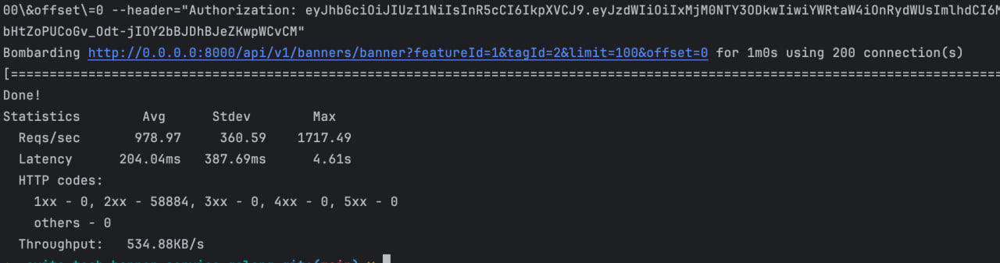

## Stack: FastAPI, PostgreSQL

## Cтруктура проекта
```
src
|-api
|    |
     v1
     |
     banners
|    |   |-serializers(схема входных и выходных данных)
|    |   |-controllers(ручки)
|    |   |-dependencies(Depends которые относятся ко всему что связано с баннерами)
|    | - auth_exceptions.py - ошибки авторизации
|    | - routing.py - Настройка роутера
|
| --- configs - настройки
| --- service - сервисы( слой логики, вызовы репозитория
| --- storages - операции с хранилищами/БД
| --- utils
|        | - generic_reponse - дженерик модель ответа от сервера. удобно использовать + можно документировать OpenAPI передавая в response_model=OkResponse[MyResponseModel]
| --- main.py - asgi-app
| - tests
```

## Benchmark
```
Тестировалось на 150 параллельных подключениях 60s и 5 воркерах(uvicorn)
```


